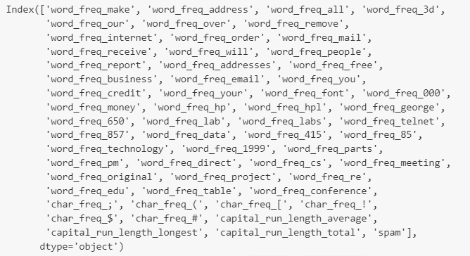
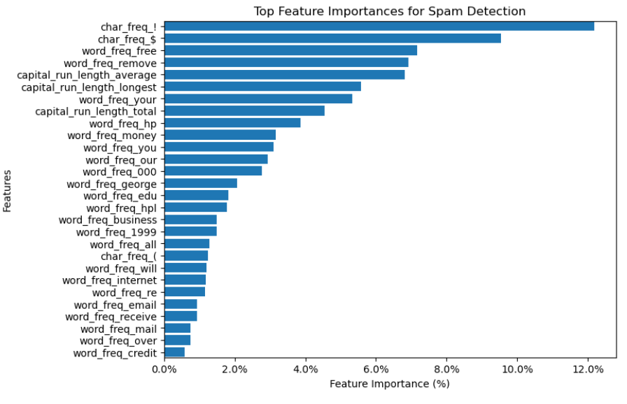

# Spam Detection/Classification with Logistic Regression and Random Forest Models

This project develops supervised machine learning (ML) models that will accurately detect spam email.  The main objective is to classify email as spam or not spam and compare the performance of two classification models: **Logistic Regression** and **Random Forest Classifier** .

**[Data](#data) | [Modeling](#modeling) | [Evaluation and Scoring](#evaluation-and-scoring) | [Technologies and Tools](#technologies-and-tools)**

---

## Abstract

The project creates classification models to fit data sourced from the UCI Spambase dataset and predict whether email is spam or not spam. Key focus is on accuracy comparison between models, to determine best approach for email classification.

The UCI Spambase dataset was pre-processed and scaled, and two models were created and trained:

* Logistic Regression Model
* Random Forest Model

---

## Data

**Sourcing** : Dataset Source: [UCI Machine Learning Library](https://archive.ics.uci.edu/dataset/94/spambase)

<figure>
    <figcaption><em></em></figcaption>
    
</figure>

**Pre-Processing:**

* `pandas`, `sklearn.model_selection` used to load dataset, inspect the dataset's structure and data types, and separate the y/target from the X/feature data, and verify label balance.
* `sklearn.preprocessing` were used to apply `StandardScaler `to scale the features for both training and test data.

---

## Modeling

### Model Selection

* **Logistic Regression** from `sklearn.linear_model`
* **Random Forest Classifier** from `sklearn.ensemble`

---

### Evaluation and Scoring

**Accuracy Metric** : The primary evaluation metric was `accuracy_score` from `sklearn.metrics`.

* **Logistic Regression** training score: 0.9296
* **Logistic Regression** accuracy_score: 0.9279
* **Random Forest Classifier** training score: 0.9997
* **Random Forest Classifier** accuracy_score: 0.9652

---

## Interpretation and Insights

Random Forest Classification has a higher accuracy 96.5%, but the Training Score of 99.97% suggests this model is highly over-fit.  The Logistic Regression model performs well at 92.8%.

Prior to modeling, I had anticipated the following:

* **Logistic Regression** might struggle with non-linear data; however, the data appeared to be fairly linear, without too many outliers, so handed the data well.
* **Random Forest** model would handle colinear Features better, but might struggle with overfitting; that seems to be the case here and the overfitting is the more dominating effect.

**Note of interest:** Reviewing Random Forest 'feature_importances', the biggest predictors of 'spam' are the **character frequency** of ! (12.2%) and $ (9.5%).  Additionally, the **presence of words**: free, remove, your, hp(?), and money dominated the feature importances:

<figure>
    <figcaption><em></em></figcaption>
    
</figure>

Technologies and Tools

* **Data Preprocessing** : `pandas` for handling and cleaning data.
* **Visualizations:** `matplotlib`
* **Scaling** : `StandardScaler` from `sklearn.preprocessing` for feature scaling.
* **Modeling** : `LogisticRegression` and `RandomForestClassifier` from `sklearn` for model training.
* **Environment** : Jupyter Notebook

---
